# Building UNet Model on OxfordIIITPet Dataset


```python
whole_train_valid_cycle(model, 15, 'UNET segmentation')
```

    Valid accuracy on 14 = 0.890987634333904


    
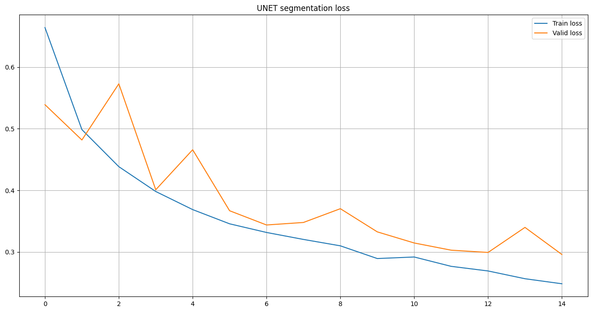
    


    
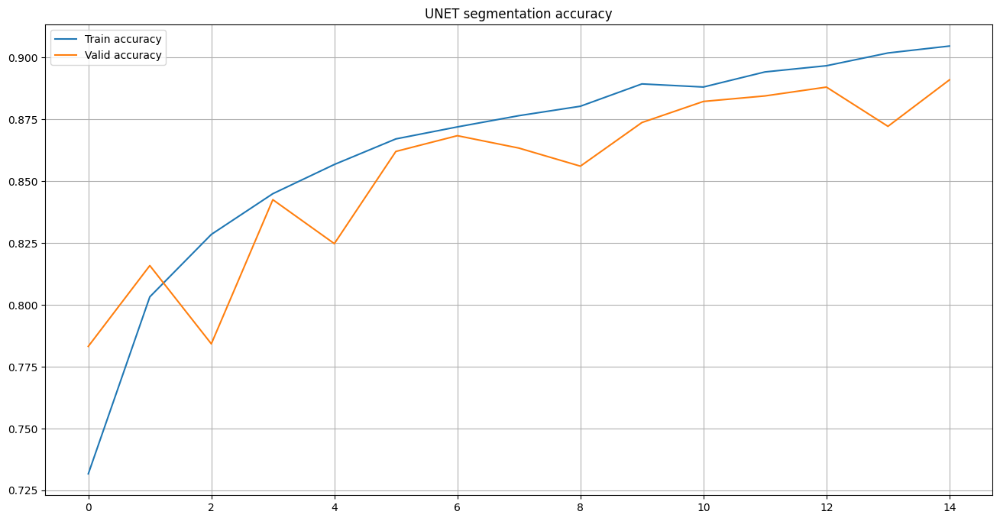
    


    
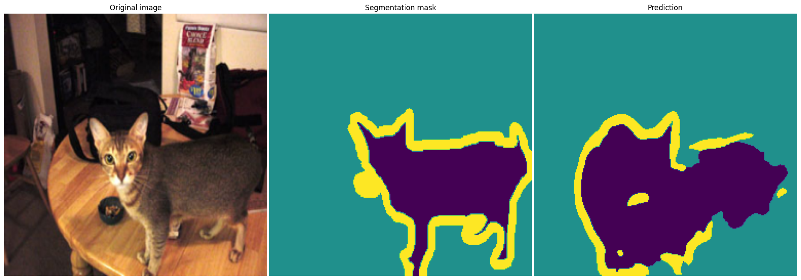
    


    
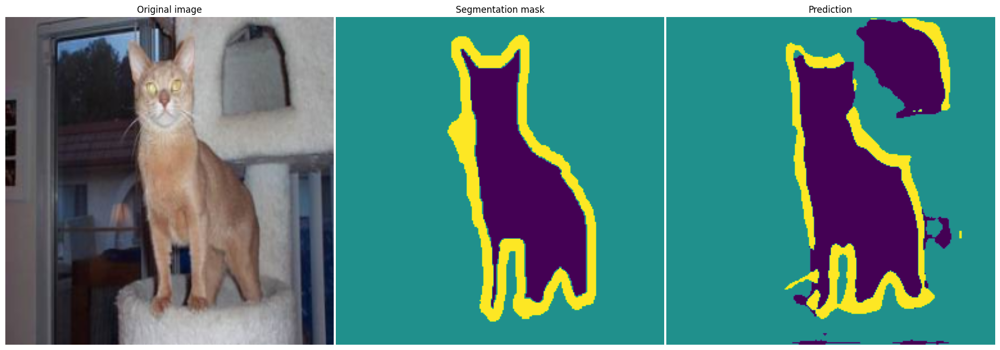
    


    
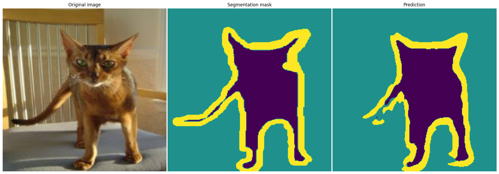
    


    
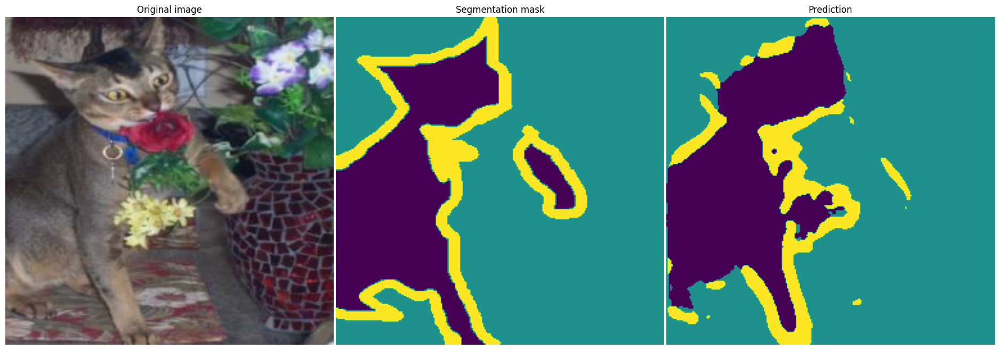
    


    
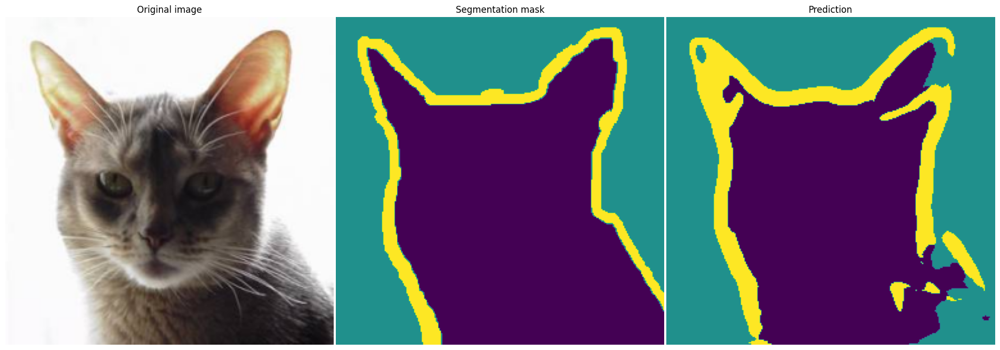
    


    
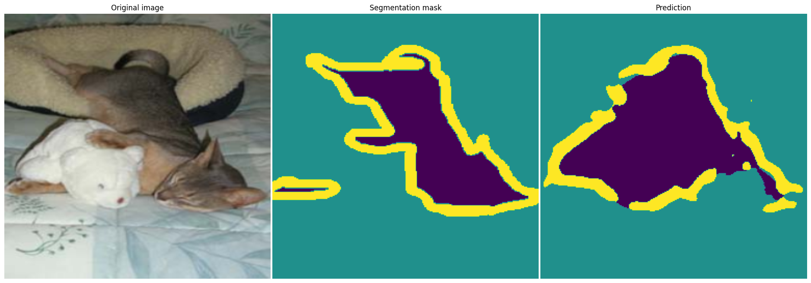
    


    
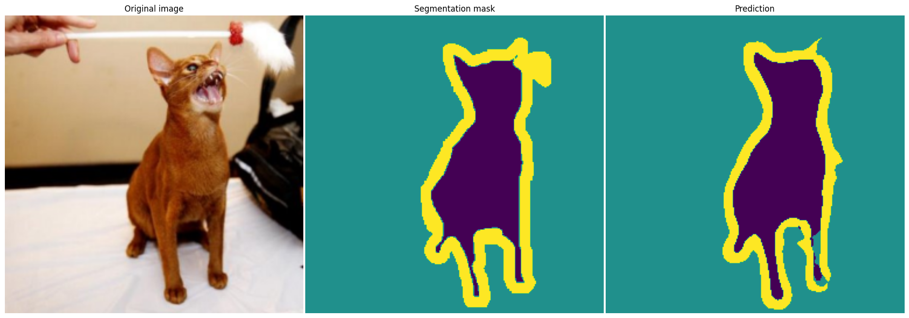
    


    
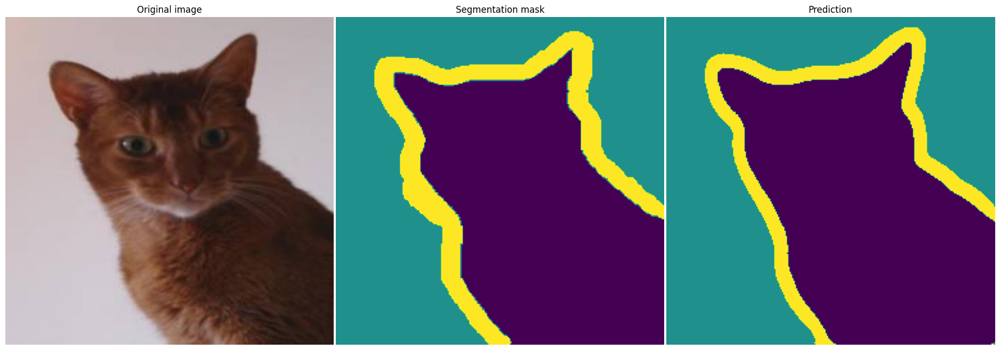
    


    
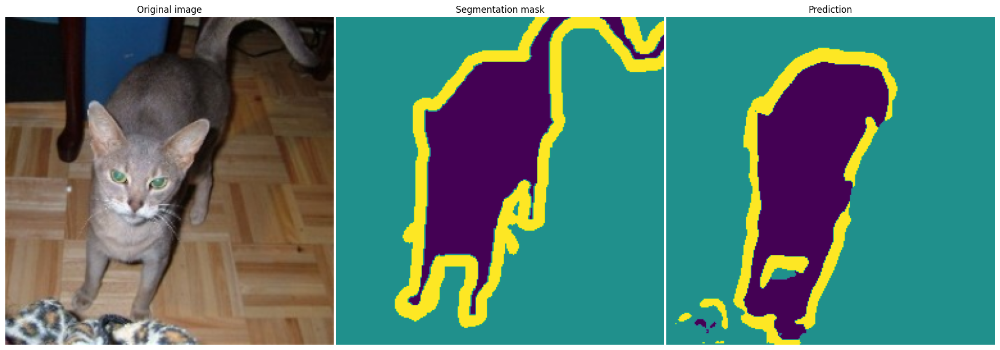
    


    
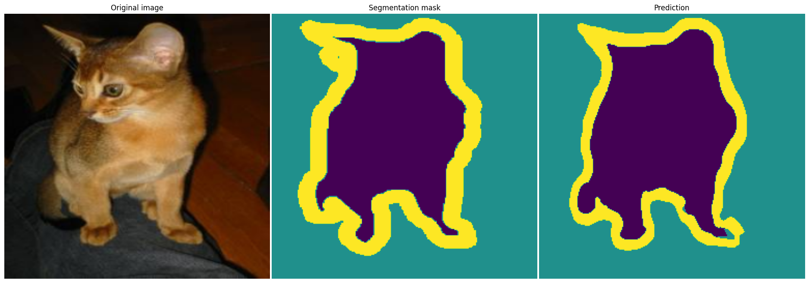
    


    Reached 89% accuracy on validation set. Stopping training.
    Valid accuracy = 0.890987634333904


```python
predictions = predict(model, valid_subset_loader, device).unsqueeze(1).to(torch.uint8)
```


```python
predictions.shape
```


    torch.Size([200, 1, 256, 256])


```python
torch.save(predictions, 'predictions.pt')
```

____
